# Git & GitHub

Check whether Git is already installed.

```bash
git --version
```
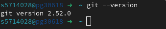

## 1. Sign up
   - [GitHub sign up](https://github.com/join)
   - Recommended: use your BU student email

## 2. First-time Git setup

```bash
git config --global user.name "YourName"
git config --global user.email yourstudentid@bournemouth.ac.uk
```
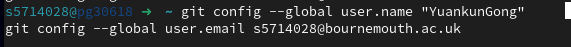

## 3. Generate a new SSH key on the lab computer
   - Do not copy your personal private SSH key to a shared machine.
   - After graduate, remove the lab computer's public key from GitHub.

On the school computer, generate a dedicated key:

```bash
ssh-keygen -t ed25519 -C "BU-lab-computer"
```

It will ask:
`Enter file in which to save the key:`

It is recommended not to use the default filename to avoid overwriting an existing key. Enter:

```bash
/home/yourID/.ssh/id_ed25519_bu_lab
```
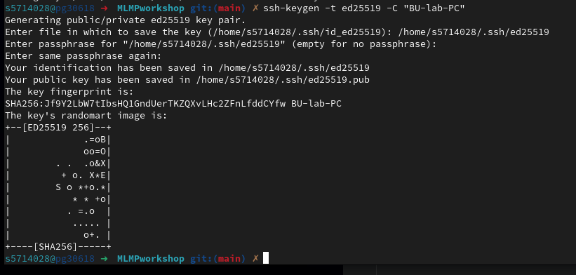

Then it will ask for a passphrase. On a shared/public computer, it is a good idea to set a passphrase instead of leaving it empty (eg. labcomputer2026).

This will create:
- `~/.ssh/id_ed25519_bu_lab` (private key)
- `~/.ssh/id_ed25519_bu_lab.pub` (public key)

Important:
- `id_ed25519_bu_lab` is the private key and must never be uploaded or shared.
- `id_ed25519_bu_lab.pub` is the public key and can be added to GitHub.

Display the public key:

```bash
cat ~/.ssh/id_ed25519_bu_lab.pub
```

Copy the entire line, which typically looks like this:

```bash
ssh-ed25519 AAAAC3NzaC1lZDI1NTE5AAAAI...... BU-lab-computer
```
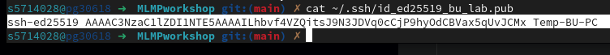

## 4. Add the public key to GitHub

Go to:
- GitHub
- Settings
- SSH and GPG keys
- New SSH key

Title: you can write `BU Lab PC`

Key type: select `Authentication Key`
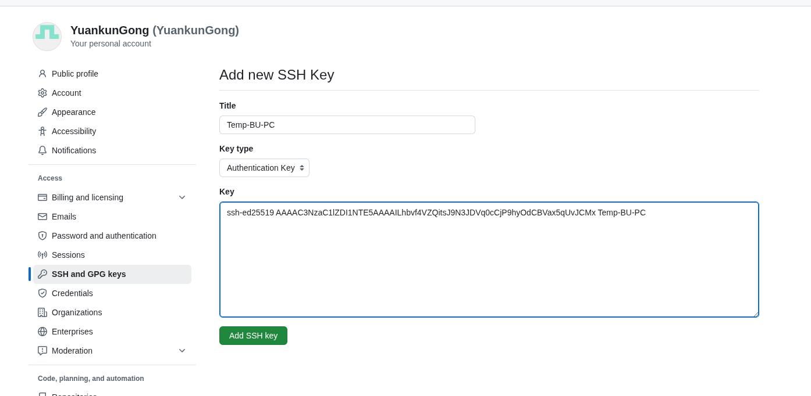

## 5. Add/load the private key on the lab computer

Then run:

```bash
ssh-add ~/.ssh/id_ed25519_bu_lab
```

Check:

```bash
ssh-add -l
```

Because your key is not using the default filename, it is better to add an SSH config file:

```bash
nano ~/.ssh/config
```

Add:

```text
Host github.com
    HostName github.com
    User git
    IdentityFile ~/.ssh/id_ed25519_bu_lab
    IdentitiesOnly yes
```
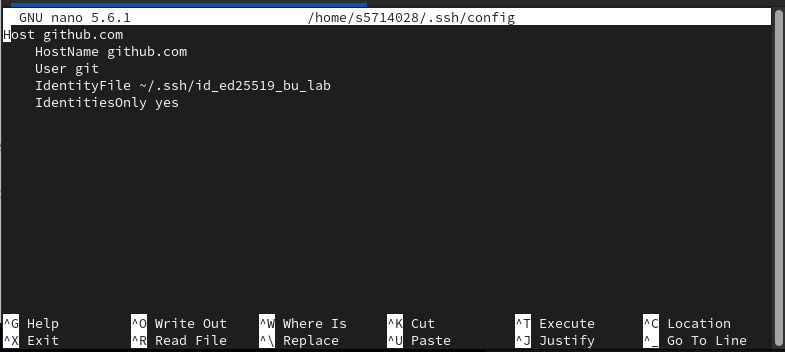

Save the file, then set the correct permissions:

```bash
chmod 600 ~/.ssh/config
```
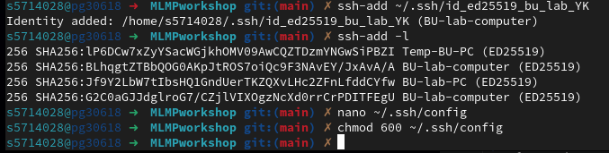

## 6. Test the SSH connection

```bash
ssh -T git@github.com
```


The first time, it may ask:
`Are you sure you want to continue connecting (yes/no/[fingerprint])?`

Type:

```bash
yes
```

On success, you should see a message similar to:

```text
Hi YourGitHubUsername! You've successfully authenticated, but GitHub does not provide shell access.
```

## 7. Create a local project 😊

```bash
uv init ~/Desktop/MLMPworkshop
cd MLMPworkshop
```
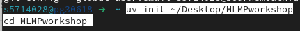

## 8. Create an empty repository on GitHub

Create a new repository on the GitHub website.
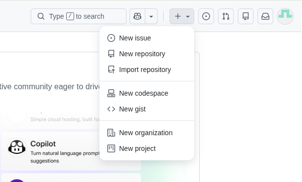

Do not select:
- README
- .gitignore
- License
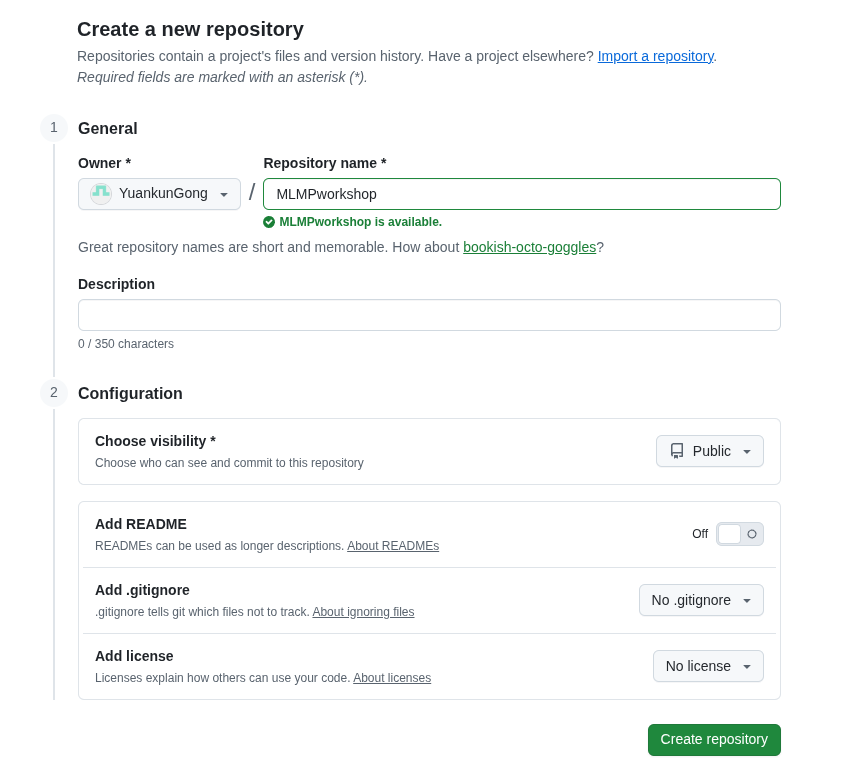

## 9. First commit

```bash
git add .
git commit -m "first commit"
```
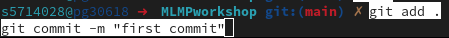

## 10. Set the default branch name

```bash
git branch -M main
```


## 11. Connect the remote repository

```bash
git remote add origin git@github.com:yourusername/MLMPworkshop.git
```

Replace `yourusername` with your GitHub username.


## 12. Push the project

```bash
git push -u origin main
```
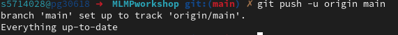

- If GitHub still asks for a password, make sure you are using SSH instead of HTTPS for the remote URL.

## 13. Make changes and push updates

After editing your files, you can push the latest changes to GitHub using either **VS Code Source Control** or the **Terminal**.

### Option 1: Use VS Code Source Control

1. Open **Source Control** from the left sidebar in VS Code.

2. Review the changed files.

3. Click the ✨ **Generate Commit Message** button to automatically generate a commit message.

4. Click **Commit & Push** to commit your changes and push them to GitHub.

> If the Generate Commit Message option is not available, you can type your own commit message manually.

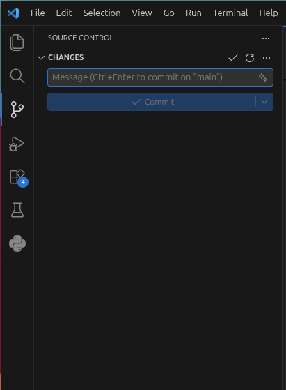

### Option 2: Use the Terminal

You can also do the same thing manually in the terminal:

```bash
git add .
git commit -m "your commit message"
git push