# LaTeX & Overleaf

## What is LaTeX?

**LaTeX** is a document preparation system widely used for academic and scientific writing.

Unlike Microsoft Word, where formatting is mainly controlled visually, LaTeX allows you to describe the **structure and content** of a document using code.

For example:

```latex
\section{Introduction}
```

tells LaTeX that this text is a section heading. LaTeX will automatically handle the numbering, font size, spacing, and overall formatting.

LaTeX is especially useful for:

- Academic papers and reports
- Mathematical equations
- Figures and tables
- Citations and references
- Large documents with consistent formatting

A LaTeX source file normally uses the `.tex` extension.

---

## What is Overleaf?

**Overleaf** is an online LaTeX editor.

It allows you to write and compile LaTeX documents directly in your browser without installing LaTeX locally.

With Overleaf, you can:

- Write and edit `.tex` files
- Compile LaTeX into PDF
- Upload figures and other files
- Manage references
- Collaborate with other users
- Share your project using a link

Go to:

[https://www.overleaf.com](https://www.overleaf.com)

---

# Tutorial

## 1. Create an Overleaf Project

Go to Overleaf and create a new project:

**New Project → Blank Project**
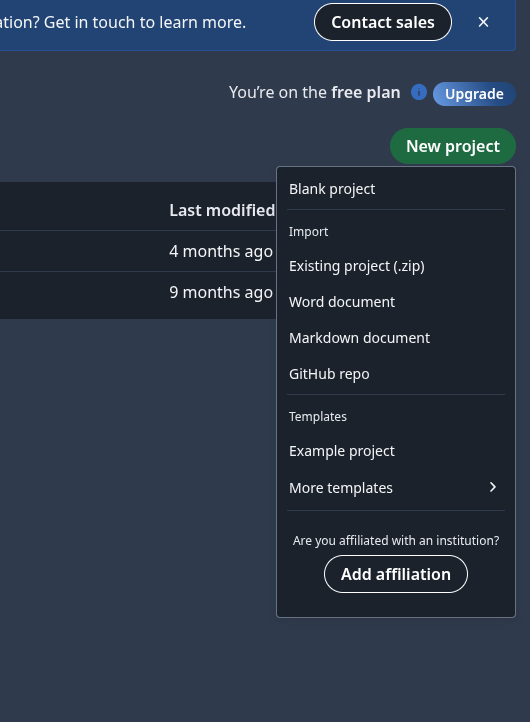

Name your project:

```text
Workshop01_LaTeX
```

You should see two main areas:

- **Source Editor** — where you write LaTeX code
- **PDF Preview** — where you see the compiled document

Click **Recompile** whenever you want to update the PDF.
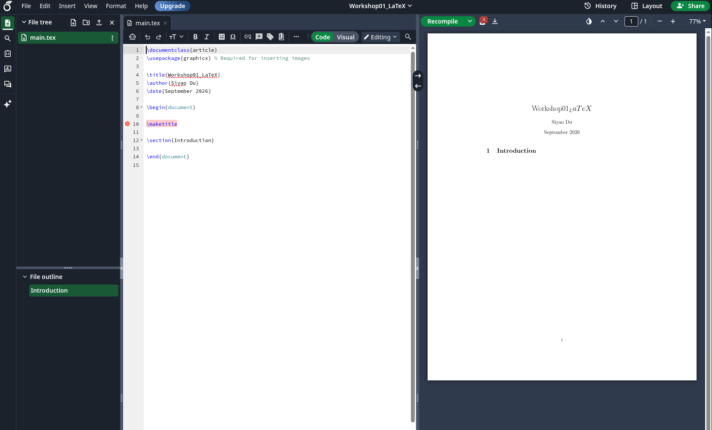

---

## 2. Create a Minimal LaTeX Document

Delete the default content and replace it with:

```latex
\documentclass{article}

\title{My First LaTeX Document}
\author{Your Name}
\date{\today}

\begin{document}

\maketitle

Hello, LaTeX!

\end{document}
```

Click **Recompile**.

The basic structure of a LaTeX document is:

```latex
\documentclass{article}

\begin{document}

Your content goes here.

\end{document}
```
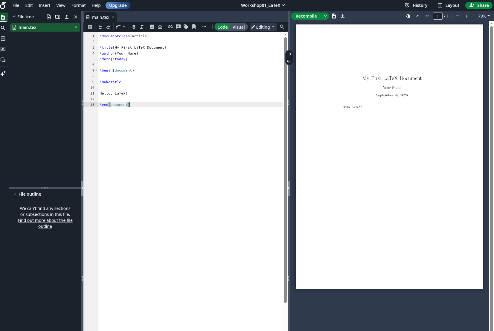

### Important commands

```latex
\documentclass{article}
```

Defines the type of document.

```latex
\begin{document}
```

Marks the beginning of the document content.

```latex
\end{document}
```

Marks the end of the document.

```latex
\maketitle
```

Creates the title using the information defined by:

```latex
\title{}
\author{}
\date{}
```

---

## 3. Sections

LaTeX automatically formats and numbers sections.

Add the following after `\maketitle`:

```latex
\section{Introduction}

This is my first document written in LaTeX.

\section{Methods}

This section describes the method.

\subsection{Dataset}

This is a subsection.

\section{Results}

This section contains the results.

\section{Conclusion}

This is the conclusion.
```
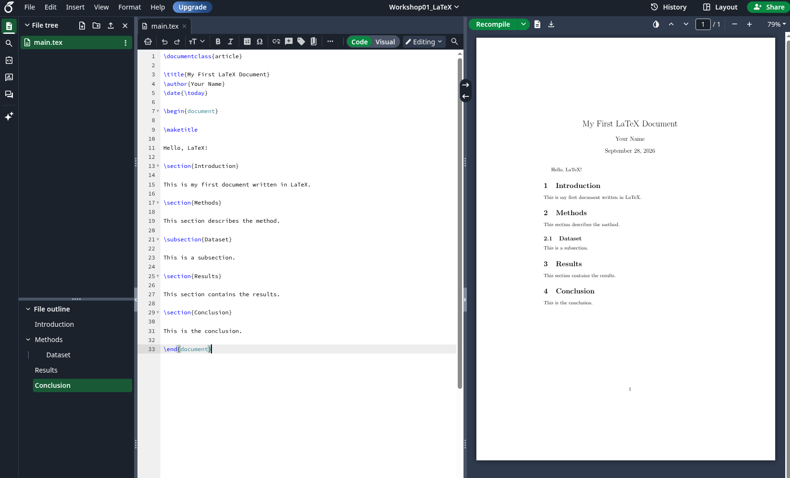

You do not need to manually type section numbers such as:

```text
1. Introduction
2. Methods
3. Results
```

LaTeX handles the numbering automatically.

---

## 4. Text Formatting

Some common text formatting commands are:

### Bold

```latex
\textbf{This text is bold.}
```

### Italic

```latex
\textit{This text is italic.}
```

### Monospace

```latex
\texttt{This text uses a monospace font.}
```

For example:

```latex
The proposed model achieves \textbf{higher accuracy} than the baseline.

The result is \textit{statistically significant}.

The implementation was written in \texttt{Python}.
```
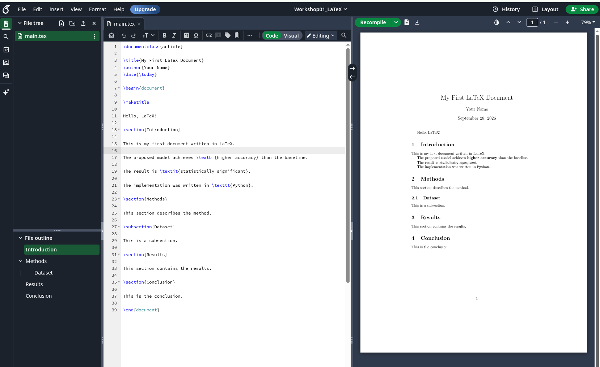

---

## 5. Equations

One of the main advantages of LaTeX is its support for mathematical equations.

### Inline Equation

Use `$...$` to include an equation inside a sentence:

```latex
The loss function is defined as $L = y - \hat{y}$.
```

### Standalone Equation

Use the `equation` environment to create a standalone numbered equation:

```latex
\begin{equation}
    E = mc^2
\end{equation}
```

LaTeX will automatically assign an equation number.

For example:

```latex
\begin{equation}
    \mathrm{MSE} =
    \frac{1}{N}
    \sum_{i=1}^{N}
    (y_i - \hat{y}_i)^2
\end{equation}
```

You can also add a label:

```latex
\begin{equation}
    \mathrm{MSE} =
    \frac{1}{N}
    \sum_{i=1}^{N}
    (y_i - \hat{y}_i)^2
    \label{eq:mse}
\end{equation}
```

Then refer to the equation in your text:

```latex
Equation~\ref{eq:mse} shows the Mean Squared Error.
```
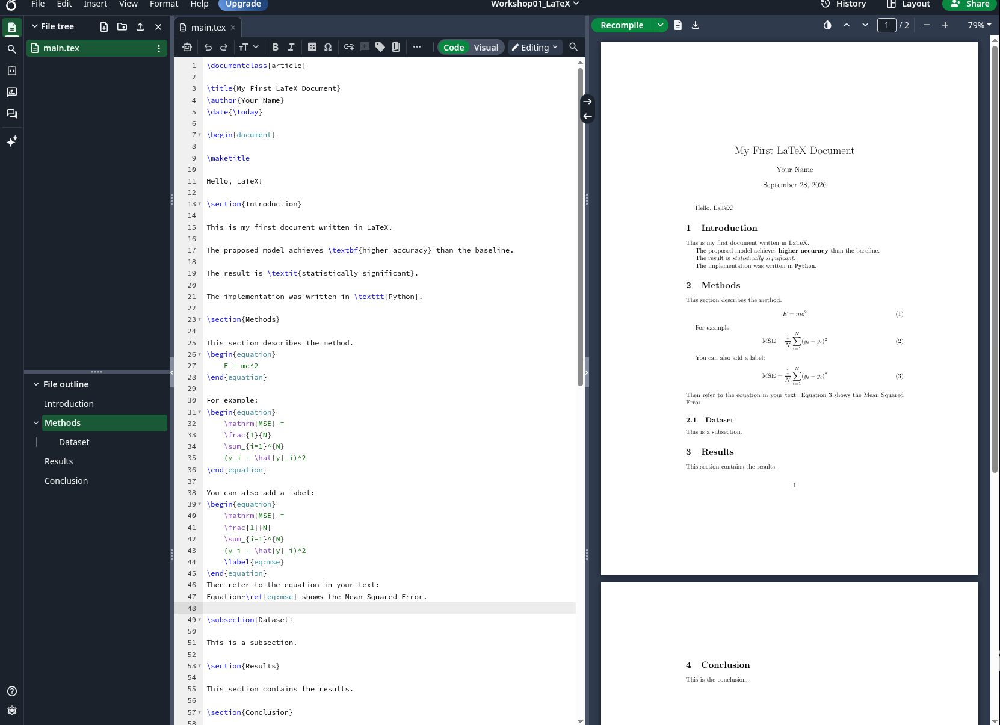

---

## 6. Figures

To add images, first include the `graphicx` package before `\begin{document}`:

```latex
\usepackage{graphicx}
```

Your document should now begin like this:

```latex
\documentclass{article}

\usepackage{graphicx}

\title{My First LaTeX Document}
\author{Your Name}
\date{\today}
```

Upload an image to your Overleaf project, for example:

```text
example.png
```

Then add:

```latex
\begin{figure}[h]
    \centering
    \includegraphics[width=0.6\textwidth]{example.png}
    \caption{An example image.}
    \label{fig:example}
\end{figure}
```

You can refer to the figure in your text using:

```latex
Figure~\ref{fig:example} shows an example image.
```

Do not manually write:

```text
Figure 1
```

Using `\ref{}` allows LaTeX to automatically update the figure number if the document changes.
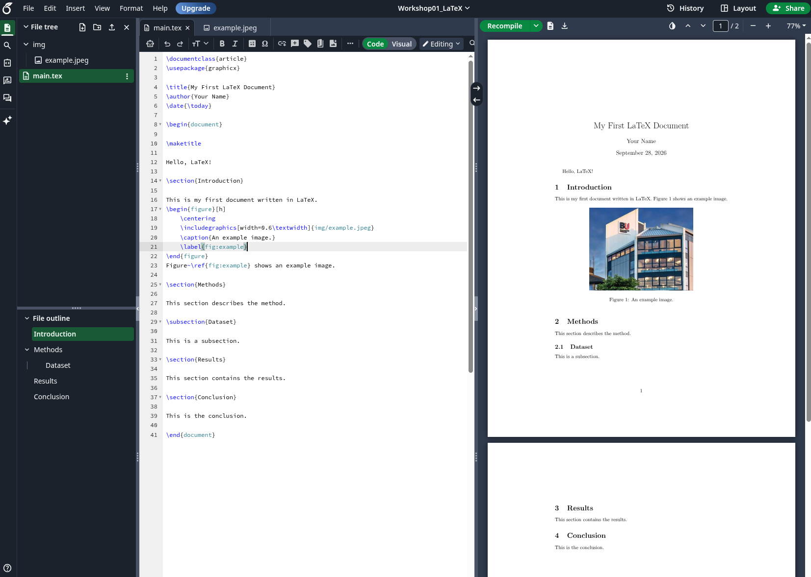

---

## 7. Tables

A simple table can be created using:

```latex
\begin{table}[h]
    \centering
    \begin{tabular}{lcc}
        \hline
        Model & Accuracy & Loss \\
        \hline
        Model A & 0.85 & 0.42 \\
        Model B & 0.91 & 0.31 \\
        \hline
    \end{tabular}
    \caption{Example experimental results.}
    \label{tab:results}
\end{table}
```

The column definition:

```latex
{lcc}
```

means:

```text
l = left aligned
c = centre aligned
c = centre aligned
```

You can refer to the table using:

```latex
Table~\ref{tab:results} shows the experimental results.
```


### Table Generator

For larger or more complex tables, you can use an online table generator:

[https://www.tablesgenerator.com/](https://www.tablesgenerator.com/)

You can create the table visually and then export it as **LaTeX code**.

Typical workflow:

1. Open [Tables Generator](https://www.tablesgenerator.com/).
2. Choose **LaTeX Tables**.
3. Create or paste your table.
4. Click **Generate**.
5. Copy the generated LaTeX code.
6. Paste it into your Overleaf document.

This is often much faster than writing a complex table manually.
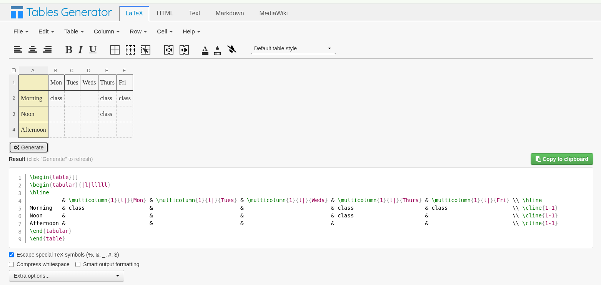
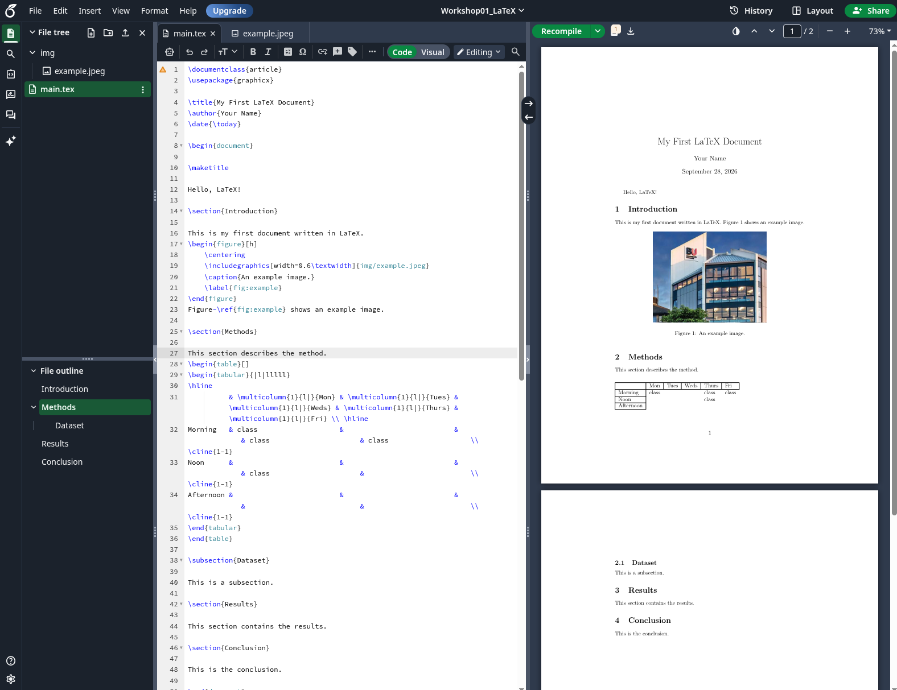
---

## 8. Citations

Academic documents usually contain references to previous research.

In Overleaf, create a new file called:

```text
references.bib
```

Add the following example reference:(which can be find in google scholar)
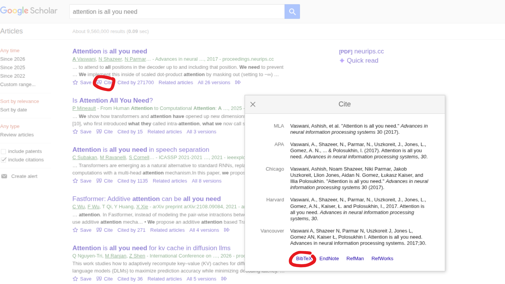

```bibtex
@article{vaswani2017attention,
  title={Attention Is All You Need},
  author={Vaswani, Ashish and others},
  journal={Advances in Neural Information Processing Systems},
  year={2017}
}
```
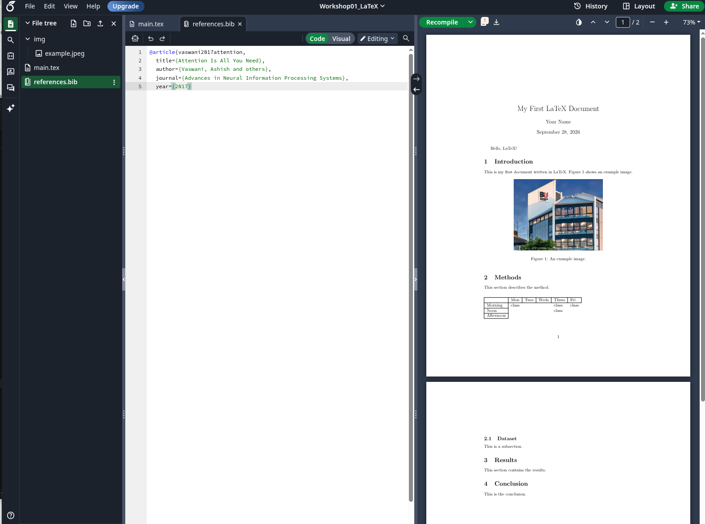

In your `.tex` file, cite the paper using:

```latex
Transformers were introduced by Vaswani et al.~\cite{vaswani2017attention}.
```

At the end of your document, before `\end{document}`, add:

```latex
\bibliographystyle{plain}
\bibliography{references}
```

For example:

```latex
\section{Conclusion}

This is the conclusion.

\bibliographystyle{plain}
\bibliography{references}

\end{document}
```

LaTeX will automatically generate the reference list.
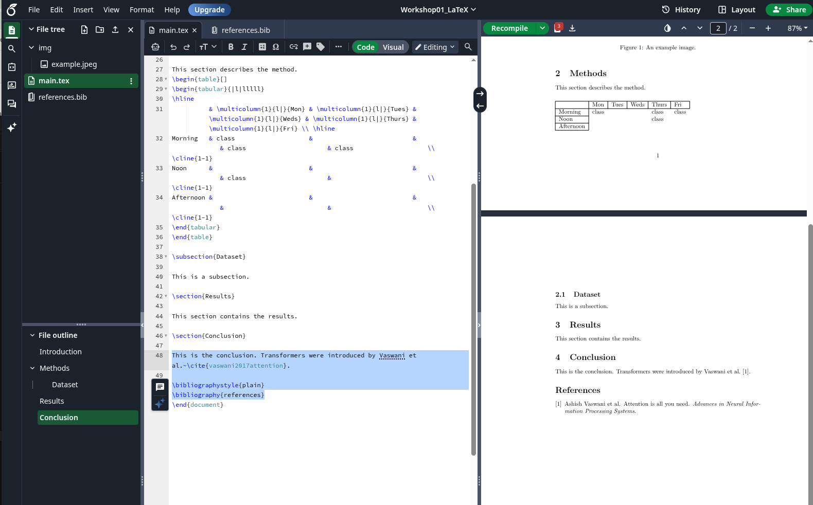

---

# 9. Task

Create a short article in Overleaf.

Your document should contain:

- A title
- Your name as the author
- An Introduction section
- A Methods section
- A Results section
- A Conclusion section
- At least one subsection
- At least one inline equation
- At least one numbered standalone equation
- At least one figure
- At least one table
- At least one citation

The academic content does **not** need to be meaningful. The purpose of this task is to practise using LaTeX and Overleaf.

Your Overleaf project should contain something similar to:

```text
Workshop01_LaTeX/
├── main.tex
├── references.bib
└── example.png
```

When you have finished:

1. Click **Share** in Overleaf.
2. Create or enable a share link.
3. Copy the Overleaf project link.
4. Add the link to the `README.md` file in your GitHub repository.

For example:

```md
# Workshop 01

## Overleaf Project

https://www.overleaf.com/...
```
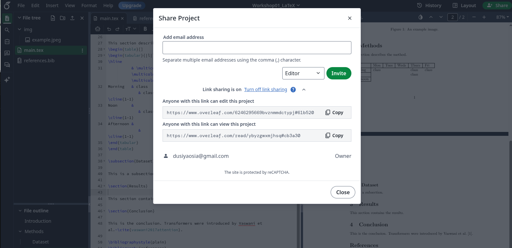
Then commit and push your updated `README.md` to GitHub.